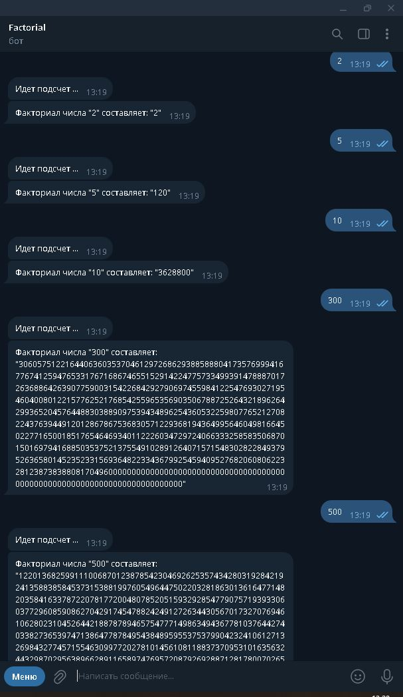

# Factorial-bot

__*Тестовое задание для трудоустройства.*__

Бот (на основе библиотеки telebot) для ТГ-канала "Factorial". Считает факториал от заданного БОТу числа. 
Оформлен в Docker контейнер.

